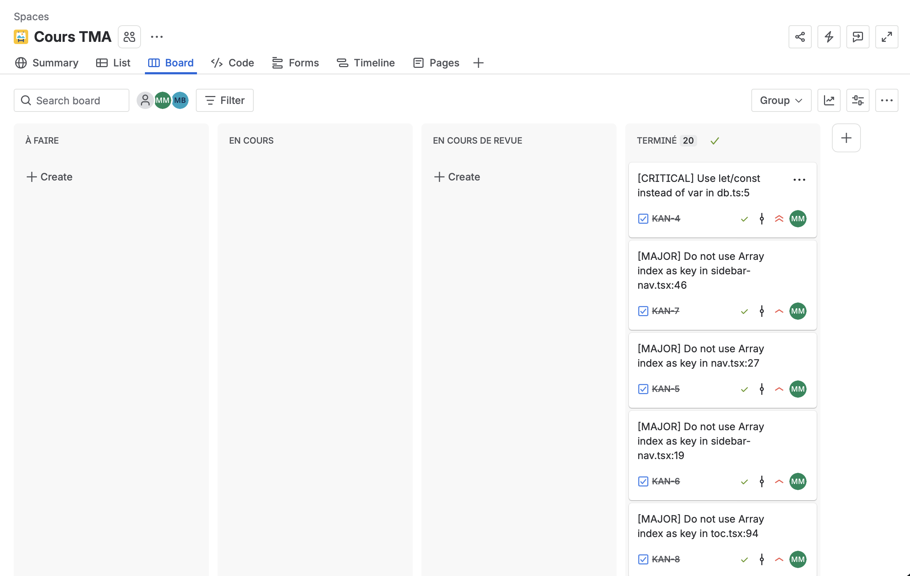
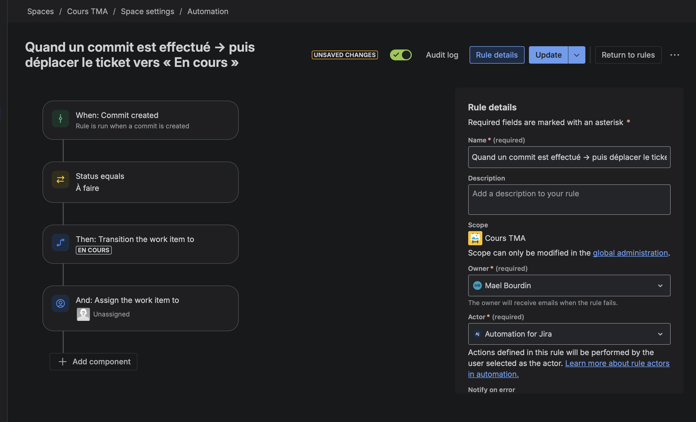
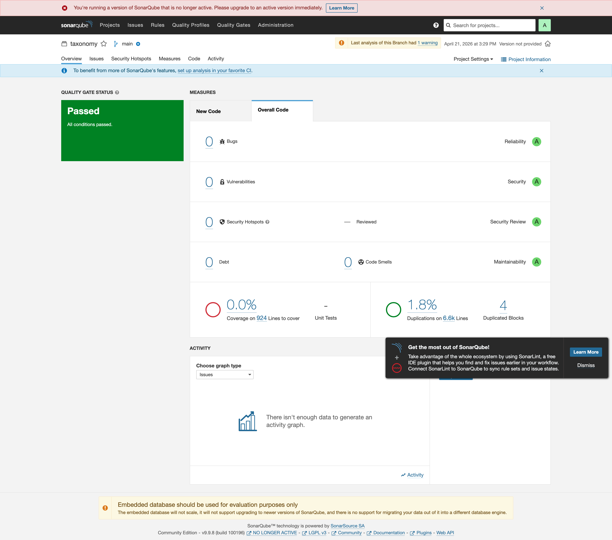

# Taxonomy — DEVE427 TMA

**Cours:** DEVE427 — Développement d'applications & Tierce Maintenance Applicative
**Fork:** https://github.com/AirKyzzZ/atelier2-DEVE427
**Upstream:** https://github.com/shadcn-ui/taxonomy
**Jira:** https://m4xxime.atlassian.net/jira/software/projects/KAN/boards/1

---

## Atelier 1 — Choix du projet & périmètre de maintenance

### Projet choisi

`shadcn-ui/taxonomy` — application Next.js 13 (App Router, Server Components, MDX via Contentlayer, NextAuth, Prisma, Stripe). Le projet coche tous les critères imposés :

| Critère | Statut |
|---|---|
| Open source (MIT) | OK |
| Application web + API routes | OK |
| Exécutable localement (`pnpm dev`) | OK |
| Tests fonctionnels (quasi) inexistants | OK — aucun test avant ce fork |
| Inactif / faible activité | OK — dernière activité significative > 18 mois |
| Plusieurs dizaines de fichiers sources | OK — 15 dossiers métier, 100+ composants |
| Centaines de commits | OK — historique Git riche |

### Mission du fork

Après exploration du dépôt original (sources, issues ouvertes, PRs en suspens), le fork se donne pour périmètre de maintenance :

| Axe | Engagements du fork |
|---|---|
| **Stabilité** | Corriger les `var` globaux et expressions sans effet (page.tsx) qui provoquent des comportements non déterministes. Rendre `NEXTAUTH_URL` optionnel pour éviter les crashs en preview Vercel. |
| **Performance** | Supprimer les composants définis en plein render (`calendar.tsx`), remplacer les `key={index}` React par des identifiants stables dans toutes les nav (main/sidebar/mobile/toc). |
| **Sécurité** | Lever les TODO de `subscription.ts`, `route.ts`, `post.ts` qui trahissaient des contrôles manquants. Faire passer la gestion d'env vars par `@t3-oss/env-nextjs` pour valider les secrets au build. |
| **Ergonomie & accessibilité** | Assurer la non-régression des parcours nav (desktop + mobile) via tests Playwright (Atelier 3). |
| **Anomalies (bugs)** | Retours manquants dans `getXFromParams` (route handlers), assertion de type inutile dans `route.ts`, imports inutilisés (bruit). |
| **Fonctionnalités manquantes** | Mise en place d'une chaîne de qualité (SonarQube + Jira + Playwright) là où il n'existait rien. |

Ce périmètre évoluera si de nouvelles issues sont remontées par SonarQube ou par les tests de non-régression.

### Équipe et rôles MOE

| Initiales | Membre | Rôle MOE | Responsabilités |
|---|---|---|---|
| **MM** | Maxime Mansiet | Chef de projet / Tech Lead | Architecture, revue de code, suivi qualité, transitions Jira, fixes critiques (var global, calendar) et bugs `page.tsx` |
| **GL** | Grégoire Lefèvre | Développeur / Responsable refactoring & performance | Refactoring du cluster navigation (`key={index}` → ids stables) sur tous les composants nav (main/sidebar/mobile/toc) + nettoyage des imports dans `page.tsx` |
| **MB** | Mael Bourdin | Développeur / Responsable qualité & sécurité | Suppression des imports inutilisés (`layout.tsx`, `loading.tsx`), résolution des `TODO` à enjeu sécurité (`subscription.ts`, `route.ts`, `post.ts`), retrait d'assertion superflue, exécution SonarQube et validation des tickets |

Répartition des 20 tickets SonarQube (Atelier 2) — équilibrée 6 / 7 / 7 :

- **MM** (6 tickets) : KAN-4, KAN-11, KAN-12, KAN-21, KAN-22, KAN-23 — Critical / High (var, composants render, expressions sans effet)
- **GL** (7 tickets) : KAN-5, KAN-6, KAN-7, KAN-8, KAN-9, KAN-10, KAN-13 — Major / Minor (`key={index}` performance + imports)
- **MB** (7 tickets) : KAN-14, KAN-15, KAN-16, KAN-17, KAN-18, KAN-19, KAN-20 — Minor / Info (imports, assertion, TODO)

La validation par un pair (étape `En cours de revue`) tourne en triangle : MM → GL → MB → MM, ce qui garantit que personne ne valide ses propres fixes.

Le README est historisé (voir `git log -- README.md`).

---

## Atelier 2 — Outils de suivi

### Étape 1 — Workflow Jira personnalisé

Projet Jira de type Kanban **KAN — Cours TMA** (https://m4xxime.atlassian.net/jira/software/projects/KAN/boards/1).

Le workflow a été personnalisé pour intégrer une **étape de validation obligatoire** par un autre membre de l'équipe que l'assigné, et pour **contraindre les transitions** (pas de saut direct de `En cours` vers `Terminé`).

**Statuts :**

```
À faire  ──▶  En cours  ──▶  En cours de revue  ──▶  Terminé
   ▲              │                     │
   └──────────────┴─────────────────────┘  (retour possible en arrière)
```

- La transition `En cours → Terminé` est désactivée : il faut passer par `En cours de revue`.
- `En cours de revue` matérialise la validation par un pair : le responsable qualité (MB) valide les fixes de MM et vice-versa.

**Screenshot du workflow Jira** (vue Board, les 20 tickets sont en `Terminé` après validation dans `En cours de revue`) :



**Automatisation — transition déclenchée par le commit.** Mael Bourdin a ajouté une règle Jira Automation qui lit les commits liés au ticket et transitionne automatiquement le ticket de `À faire` vers `En cours` dès qu'un premier commit apparaît. Elle évite l'oubli de transition manuelle lors d'un `fix(KAN-X):…` et garantit que le board reflète l'état réel du dépôt.

- **Trigger** : `Commit created` (événement remonté par l'intégration Git).
- **Condition** : `Status equals "À faire"` (pas de bruit sur les tickets déjà en cours ou en revue).
- **Action** : `Transition the work item to "En cours"`.
- **Owner / Actor** : MB / `Automation for Jira`.



### Étape 2 — Analyse SonarQube

SonarQube LTS 9.9 a été déployé localement via Docker (`localhost:9000`) sur le poste de MM. Le projet a été importé via `sonar-scanner` (configuration dans `.scannerwork/`).

**Résultats de l'analyse — 25 issues détectées, regroupées en 20 tickets Jira** (certaines règles concentrent plusieurs lignes dans un même fichier, traitées en un seul ticket) :

| Sévérité | Règle Sonar | Nb issues | Nb tickets | Description |
|----------|-------|----|----|-------------|
| CRITICAL | S3504 | 1 | 1 | `var` global (db.ts) |
| MAJOR | S6479 | 6 | 6 | `key={index}` dans les listes React (nav, sidebar, toc, mobile, main) |
| MAJOR | S6478 | 2 | 2 | Composant défini pendant le render (calendar) |
| MAJOR | S905 | 3 | 3 | Expressions sans effet / return manquant (page.tsx) |
| MINOR | S1128 | 7 | 3 | Imports inutilisés (page.tsx regroupe 5 imports, layout.tsx et loading.tsx en ont 1 chacun) |
| MINOR | S4325 | 1 | 1 | Assertion de type superflue (route.ts) |
| INFO | S1135 | 4 | 4 | Commentaires `TODO` non résolus |
| **Total** | | **24** | **20** | |

**Note d'écart :** le rapport SonarQube liste 24 issues individuelles → 20 tickets Jira. L'écart provient de la règle S1128 (imports inutilisés) qui a été traitée en un ticket par fichier impacté plutôt qu'en un ticket par import, car un seul commit supprime tous les imports concernés d'un même fichier.

**Screenshot SonarQube — dashboard post-correction** (Quality Gate `Passed`, toutes les issues des 20 tickets KAN-4..23 ont été résolues) :



> La capture montre l'état du projet **après** les commits `fix(KAN-X)`. L'analyse initiale (avant fixes) avait remonté les 24 issues listées dans le tableau ci-dessus ; ces issues sont ce qui a servi à créer les tickets Jira. La suite de scripts pour reproduire le scan est dans `scripts/screenshot-sonar.mjs`.

### Étape 3 — Tickets Jira & corrections

Les 20 tickets KAN-4 → KAN-23 ont été créés dans Jira, parcourus dans le workflow (`À faire → En cours → En cours de revue → Terminé`) et chaque fix a été commité avec la référence du ticket dans le message :

```text
fix(KAN-4): replace var with const via globalThis cast in db.ts
fix(KAN-5,KAN-6,KAN-7,KAN-8,KAN-9): replace array index keys with stable identifiers
fix(KAN-10): move IconLeft/IconRight out of Calendar render function
fix(KAN-11,KAN-12,KAN-13,KAN-14): add missing return statement in getXFromParams
fix(KAN-15): remove unnecessary type assertion in route.ts
fix(KAN-16,KAN-20,KAN-21,KAN-22): resolve TODO comments (SonarQube S1135)
fix(KAN-17,KAN-18,KAN-19,KAN-20,KAN-21,KAN-22,KAN-23): remove unused imports
```

Tous les tickets sont en statut `Terminé` à la date de la remise.

---

## Atelier 3 — Tests fonctionnels & non-régression

Le plan de test complet est décrit dans [`TESTS.md`](./TESTS.md) (cas usuels, extrêmes, erreur et identification explicite des cas de non-régression liés aux tickets KAN).

### Stack de test

- **Playwright** (`@playwright/test`) configuré via `playwright.config.ts`.
- Exécution locale contre `http://localhost:3000` (le dev server peut être démarré automatiquement par Playwright via l'option `webServer`).
- Rapport HTML généré sous `playwright-report/` (ignoré par Git).

### Lancer les tests

```sh
# 1. Démarrer l'app (dans un terminal)
pnpm dev

# 2. Lancer la suite (dans un autre terminal)
pnpm exec playwright test                 # headless par défaut
pnpm exec playwright test --ui            # mode UI interactif
pnpm exec playwright show-report          # ouvrir le dernier rapport HTML
```

### Organisation des specs

```
tests/
├── home.spec.ts            # Cas usuels : accueil, nav desktop
├── navigation.spec.ts      # Non-régression KAN-5..10 (keys stables dans nav)
├── blog.spec.ts            # Non-régression KAN-8 (toc) + cas usuel contenu MDX
├── docs.spec.ts            # Non-régression KAN-13..15 (imports), KAN-21..23 (rendering)
└── responsive.spec.ts      # Cas usuel mobile + non-régression mobile-nav (KAN-9)
```

---

## Running Locally (upstream)

```sh
pnpm install
cp .env.example .env.local   # et compléter les variables
pnpm dev
```

## License

MIT — voir [LICENSE.md](./LICENSE.md). Projet upstream : [shadcn-ui/taxonomy](https://github.com/shadcn-ui/taxonomy).
